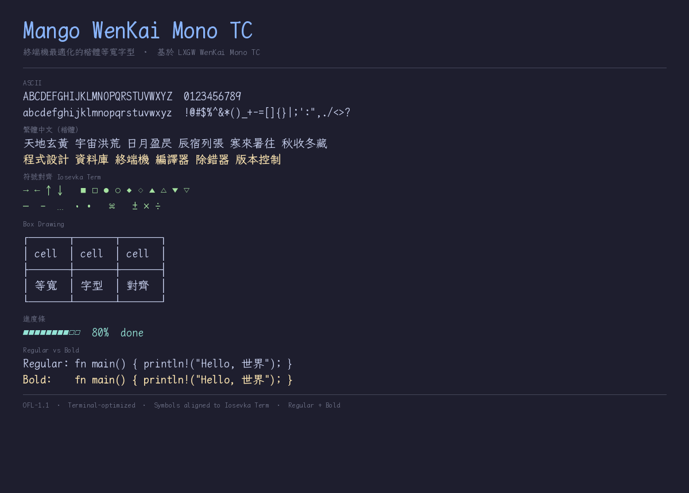
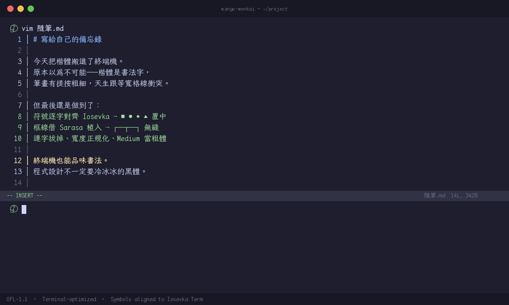

# Mango WenKai Mono TC

終端機最適化的楷體等寬字型 — 基於 [LXGW WenKai Mono TC](https://github.com/lxgw/LxgwWenKai)，為終端機重新調校。

### 終端機效果

## 為什麼做這個

LXGW WenKai（霞鶩文楷）是最美的開源楷體，但它是為閱讀設計的——符號畫在全形字身，放進終端機會爆框、偏移、框線接不起來。

Mango WenKai 把它改造成終端可用的楷體：符號逐字對齊 Iosevka Term（終端字型標竿）、框線無縫 tiling、等寬嚴格 2:1。保留楷體的書法美感，加上終端的精準格線。

## 特色

- **楷體風格** — 保留 LXGW WenKai 的書法美感，終端裡也能品味楷書
- **符號逐字對齊 Iosevka Term** — 箭頭、幾何、標點、技術符號全部置中不爆框
- **Box Drawing 無縫 tiling** — 框線植入自 Sarasa Mono TC（be5invis），端點觸界畫框接得起來
- **中英文寬度 2:1 嚴格對齊** — East Asian Width 正規化
- **Regular + Bold 兩字重** — Bold 使用 Medium (500) 字重頂替，保留楷體筆鋒（楷體不做 700 加粗，會毀壞起收筆）
- **連字移除** — 終端不該有 ligature
- CJK 使用台灣標準字形

## 下載

| 字重 | 檔案 | 說明 |
|------|------|------|
| Regular (400) | [`MangoWenKaiMonoTC-Regular.ttf`](MangoWenKaiMonoTC-Regular.ttf) | 一般用 |
| Bold (Medium 500→700) | [`MangoWenKaiMonoTC-Bold.ttf`](MangoWenKaiMonoTC-Bold.ttf) | 終端粗體，保留楷體筆鋒 |

## 後處理 Pipeline

基於上游 LXGW WenKai Mono TC 經過 7 階段後處理：

1. `strip_ligatures.py` — 移除 GSUB ligature lookup（終端不該有連字）
2. `normalize_advances.py` — advance 對齊 East Asian Width（全形 2:1）
3. `complete_glyph_pairs.py` — 補缺字（實心 ▰ 由空心 ▱ 衍生）
4. `fit_glyph_to_advance.py` — 爆框符號等比例縮進 advance 框
5. `align_symbols.py` — 全符號區段逐字對齊 Iosevka Term 佔格比例
6. `inject_box_glyphs.py` — 植入 Sarasa Mono TC 的 Box Drawing / Block Elements（楷體框線數學上無法 tiling，用等寬黑體替換）
7. `verify_font_metrics.py` — Golden invariant 量化驗證

Bold 額外經過 `retag_weight.py`（Medium 500 → Bold 700 re-tag）。

## 來源

| 部分 | 來源 | 授權 |
|------|------|------|
| 楷體本體 | [LXGW WenKai Mono TC](https://github.com/lxgw/LxgwWenKai) v1.522 | OFL-1.1 |
| Box Drawing / Block | [Sarasa Mono TC](https://github.com/be5invis/Sarasa-Gothic) v1.0.39 | OFL-1.1 |
| 符號對齊基準 | [Iosevka Term](https://github.com/be5invis/Iosevka) v34.6.1 | OFL-1.1 |

## 授權

本衍生字型遵循 [SIL Open Font License 1.1](LICENSE)。
原始字型的著作權歸各自作者所有。

"LXGW WenKai" 為 lxgw 的 Reserved Font Name，本衍生字型依 OFL 規範改名為 "Mango WenKai"。
